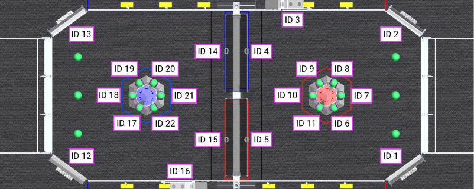

# How to get positions of April Tags
#### 1. Get the reefscape information
```
var layout = AprilTagFieldLayout.loadField(AprilTagFields.k2025Reefscape);
```
#### 2. Get the April Tags you want
```
layout.getTagPose(id);
```
__This returns in METERS and QUATERNIONS__

#### To get all Tags (List\<AprilTag>)
```
layout.getTags();
```
### Misc
The april tag information is stored on "2025-reefscape.json" in the source code.
__There is a copy of this stored in this folder__

[2025-reefscape.json](2025-reefscape.json) (meters and quaternions)

#### The Map of the IDs

