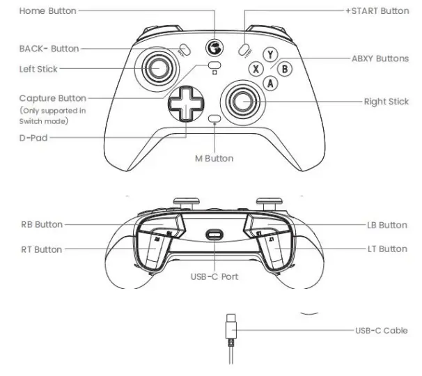

## Table of Contents
- [**Controller mappings**](#controller-mappings)
  - [**GameSir T4 Kaleid Controllers**](#gamesir-t4-kaleid-controllers)
    - [Drive Controller](#drive-controller)
    - [Operator Controller](#operator-controller)
  - [**FightSticks Controller**](#fightsticks-controller)
    - [Preset Board](#preset-board)
      - [Coral Mode](#coral-mode)
      - [Algae Mode](#algae-mode)
    - [Sim Board](#sim-board)
      - [Sim](#sim)
      - [Real](#real)
    - [Test Board](#test-board)
    - [Motor Board](#motor-board)
- [Controller Software](#controller-software)

# **Controller mappings**

## **GameSir T4 Kaleid Controllers**
### Drive Controller
Port: 0

Right X Axis Joystick: Rotates Robot

Left Joystick: Controls robot movement (X axis for left/right, Y axis for forward/backward)

Start Button: Sets the robot's movement direction based on its current orientation (gyro reset)

Back Button: Turns off the lift auto pid

Button A: Align with the reef

Button B: Runs intake voltage at 3 volts

Button Y: Toggles anti tip

Left Bumper: Align with nearest reef

Left Trigger: Speeds up robot

Right Bumper: Slow Mode

Right Trigger: Shoots algae grabber

POV Up: Outtakes coral
### Operator Controller
Port: 1

Button Y: Runs Lift to safe

Button A: Confirm Coral Preset Board Position

Button X: Get Auto Place Command

Button B: Sets lift voltage to 0

Left Bumper: Move Gantry Left

Right Bumper: Move Gantry Right

Right Joystick Y: Climber Elevator Up/Down

Back Button: Sets gantry to home

Start Button: Lift Home

Right Trigger: Algae Process

Operator POV Up: Part 1 of climber, unwinds arm, lowers lift, and sets the clamp state to false

Operator POV Down: Part 2 of climber, sets clamp state to true, winds arm, does the winch

Operator POV Left: Cancel command (default command is pid to climber default position)

Operator POV Right: Unhooks the Lift

## **FightSticks Controller**
### Preset Board
Port: 2

Joystick Up: Algae Mode

Joystick Down: Coral Mode

#### Coral Mode
L2: Left level 4

L1: Right level 4

A: Left level 3

X: Right level 3

B: Left level 2

Y: Right level 2

R2: Share

R1: Trough
#### Algae Mode
L2/L1: Level 4 (Just goes to coral level 4)

A/X: Level 3

B/Y: Level 2

R1/R2: Trough (Coral)
### Sim Board
Port: 3
#### Sim
B: Activates Gantry Limit Switch

A: Activates Lift Limit Switch

Y: Activates Coral Detector

L2: Activates Climber Lift Limit Switch

L1: Activates "Has Algae"
#### Real

Does nothing

### Test Board
Port: 4

Doesn't do anything

### Motor Board
Port: 5

B: Runs the Lift Voltage

A: Runs Gantry Voltage

L2: Sets Intake Voltage

L1: Sets Algae Motor Voltage

X: Runs elevator voltage (V: -1)

R2: resets LiftSubsystem encoder

# Controller Software

Download Gamsesir T4k App: [Site](https://gamesir.com/pages/gamesir-t4k-app?srsltid=AfmBOopEweKJXB8Kw_ZJ6K9aPAazIYmm-peuel_OzsGSdFCpT5HZT_ZI) (Controller Configuration)
