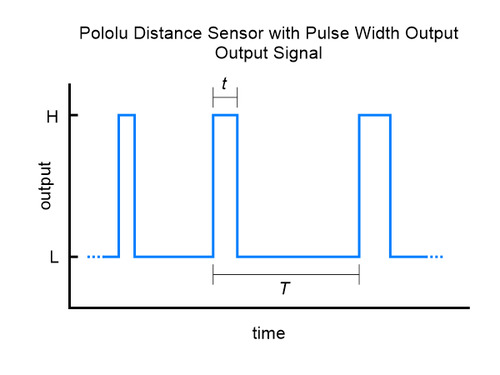
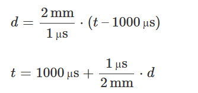
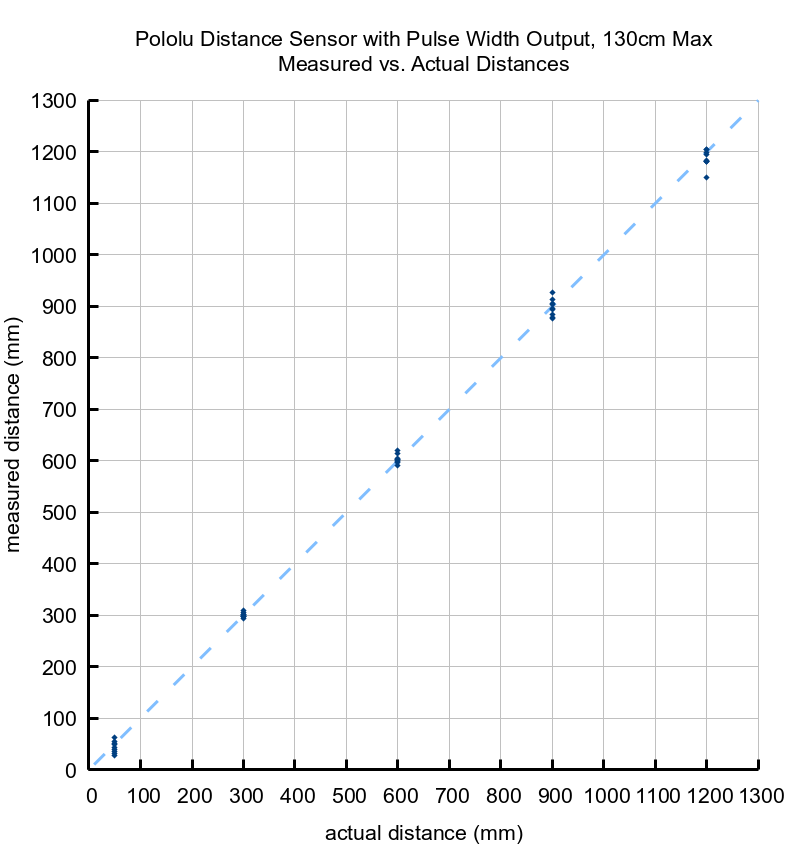
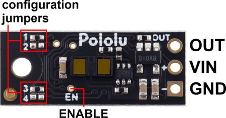
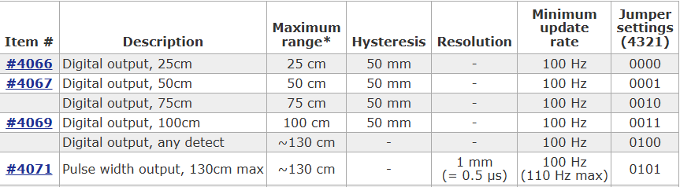
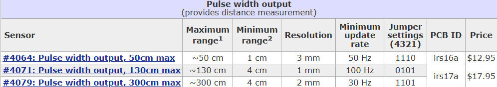

# Distance Sensor
The distance sensor is a Polulu 4071 (130cm max)

Product Page: https://www.pololu.com/product/4071

## Information
### Time Diagram

### Specifications
Operating voltage: 3.0 V to 5.5 V

Current consumption: 30 mA (typical) when enabled, 0.4 mA when disabled

Maximum range: approximately 130 cm (50″) (for high-reflectivity targets in good ambient conditions; lower-reflectivity targets or poor ambient conditions will reduce the maximum detection range)

Minimum range: 4 cm (for accurate measurement); < 1 mm (for detection)

Update rate: 100 Hz to 110 Hz (10 ms to 9 ms period)

Field of view (FOV): 15° typical; can vary with object reflectance and ambient conditions

Output type: digital pulse width

Dimensions: 0.85″ × 0.35″ × 0.136″ (21.6 × 8.9 × 3.5 mm); see the dimension diagram for more information
Weight: 0.014 oz (0.4 g)

Dimension Diagram: https://www.pololu.com/file/0J1812/pololu-digital-distance-sensor-dimensions-irs17a.pdf
The relationship between measured distance d (in mm) and pulse width t (in µs) is as follows:

The timing uncertainty is approximately ±5%. As objects approach the sensor, the output pulse width will approach 1.0 ms, while an object detected at 130 cm will produce a 1.65 ms pulse width. The sensor uses a pulse width of 2.0 ms to indicate no detection. The pulse period T ranges from around 9 ms to 10 ms, depending on the proximity of the detected object.

The maximum detection range depends on object reflectivity and ambient lighting conditions. In our tests, the sensor was able to reliably detect a white sheet of paper out to its maximum range of 130 cm, and it could reliably detect a hand out to around 80 cm away. The following graph shows the measured distances of three units versus their actual distances from a variety of targets at several different ranges:

Three connections are necessary to use this module: VIN, GND, and OUT. These pins are accessible through a row of 0.1″-pitch through holes, which work with standard 0.1″ (2.54 mm) male headers and 0.1″ female headers (available separately). The VIN pin should be connected to a 3 V to 5.5 V source, and GND should be connected to 0 volts. The sensor outputs its digital pulses on the OUT pin. The low level of the pulses is 0 V, and the high level is VIN. A red LED on the back side of the board also lights whenever an object is detected (the closer the object, the brighter the LED).

Jumper settings (irs17a)
The board features four surface-mount configuration jumpers that determine its operation mode. Different versions of the Pololu Digital Distance Sensors ship with the appropriate jumpers pre-populated with 0 Ω resistors. These resistors can be desoldered from the populated spots or solder bridges can be added across the unpopulated spots to convert one sensor version into another. This sensor can be converted into any other irs17a version as listed in the following table. (For more information about how the different output types work, see the product pages for representative versions.)

(The one installed is #4071)

