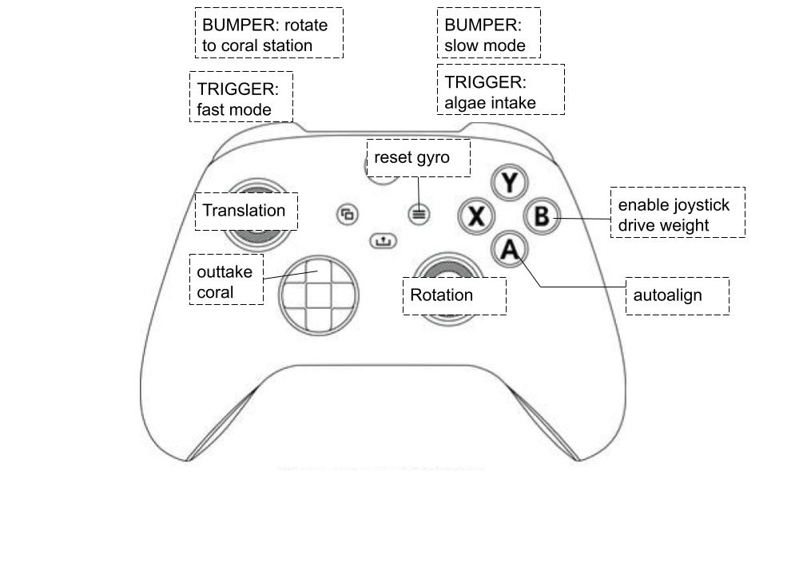
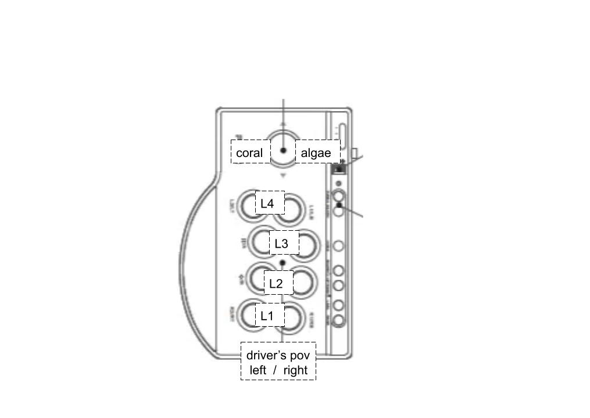
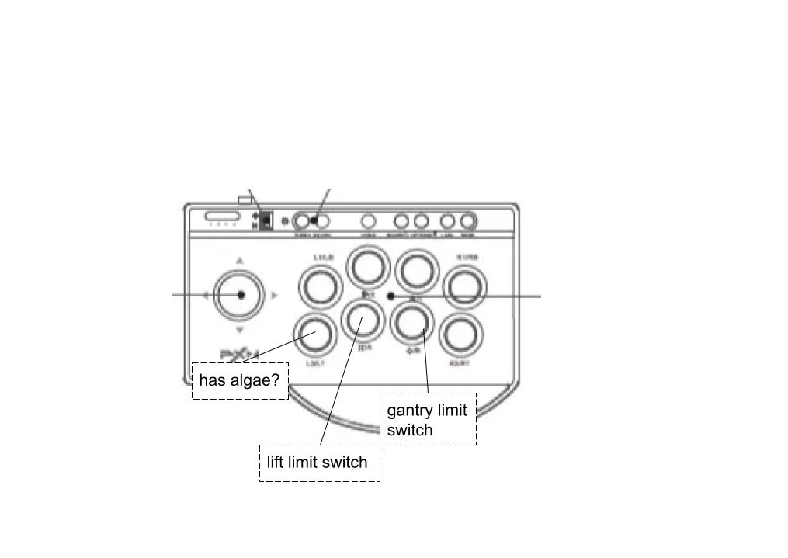

# Controllers

## Drive Controller

## Operator Controller

## Preset Board

## Sim Board

*See [the original google drawings](https://drive.google.com/drive/folders/15uayR-ws5tpbkeXHXuQXuZxihXcZ9VDh?usp=sharing) to add/edit* (make your change in the drawing, download the image, and replace the image file in the controllers folder in code)
